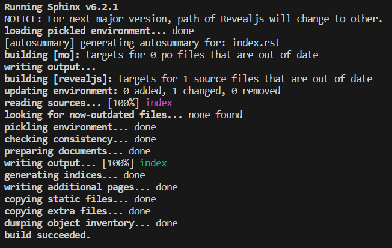

Welcome to my first presentation
################################

First slide
===========

- Bullet 1
- Bullet 2

.. code-block:: python

    def my_function():
        print("Hello world!")

Sub-slide
---------

My first Sub-slide.

Second slide
============

- Bullet 1
- Bullet 2

